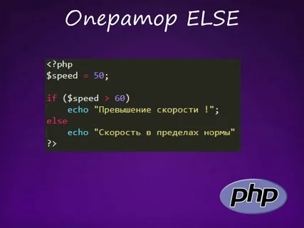

# Условия в JavaScript

## Введение
Условные операторы позволяют выполнять различные действия в зависимости от условий. В JavaScript существуют следующие условные операторы:

- `if`
- `else`
- `else if`
- `switch`

## Оператор `if`
Оператор `if` используется для выполнения блока кода, если условие истинно.




## Оператор `if else`
Оператор `if-else` позволяет выполнять два блока кода: для истинного и ложного условий. Это позволяет управлять поведением программы в зависимости от входных данных и состояний.


## Оператор `else`
Оператор else  выполняется в том случае, если условие, указанное в if, ложно. 


# What is JavaScript Loop?
Loop is a JavaScript control statement which executes blocks of code repeatedly. A code block or block of code is a code between {and}. Types of loops in JavaScript are:


- `while loop`
- `do-while loop`
- `for loop`
- `for…in loop`


## While Loop in JavaScript

The while loop executes a block of code repeatedly i.e. it execute the code block until the given condition is true else the loop gets terminated.

We use a variable to check the condition. The variable meets the condition at the entrance of the while loop. If the variable does not meet the condition then the loop will not get executed not even for a single time. Due to this, it is possible that statements inside the while loop is never executed. The following flowchart describes the while loop statement.


### How does the while loop work in JavaScript?
The while loop in JavaScript works exactly in the same as the while loop works in other programming languages such as C, Java, C#, etc. as follows:
 1. The While loop first check the condition
 2. If the given condition is true, then the statement block within the while loop are executed
 3. This process is going to be repeated as long as the condition evaluates to true.
 4. Once the condition false, then loop terminates.

 ### What is infinite loops?
 If you forgot to update the variable which is evaluates in the condition, then it will create a never ending loop which is also called as an infinite loop. For example, if you notice in the below code, we have commented the line which updates the counter variable. As a result of this, the counter variable is always ZERO and the condition in the while loop is always going to be true. In other words, we can say that, the condition will never become false, and we have an infinite while loop.

### *How to solve the problem?*
We can solve the problem by using break statement within the while loop in JavaScript.  

### *The `break` statement in JavaScript*
As we have seen in the earlier chapter of JavaScript Condition for switch statements where the `break` statement is used. There it was used to “come out” of the switch statements. The `break` statement can also be used in the loop to “comes out” of the loop by exiting the inner-most loop where it is declared.

As the name suggests the `break` statement is used in JavaScript to break or terminate the loop in between and continues executing the code placed after the loop if there is any.

### Example to understand JavaScript break statement:

Let us understand the use of break statement in a while loop with an example. Now we want the while loop to terminate or break when the counter variable becomes 5. If you notice in the below code, we use a if statement to check the counter variable and when the counter variable becomes 5, the if condition becomes true and this will execute the break statement, which will terminate the execution of the while loop.

```javascript
<script type="text/javascript">
        var counter = 0;
        while (counter < 10) {
            if (counter == 5)
                break;//break loop only if counter==5
            console.log('Number : ' + counter);
            counter++;
        }
</script>
```

Output:
Number: 1
Number: 2
Number: 3
Number: 4
Number: 6
Number: 7
Number: 8
Number: 9
Number: 10

### Using label with break and continue statement

Syntax:
 - break labelname;
 - continue labelname;

 ### Using JavaScript break with label
*Example:*

```javascript
<script type="text/javascript">
        var counter = 0;
        check: while (counter < 10) {
            if (counter == 5)
                break check;//break loop only if counter==5
            console.log('Number : ' + counter);
            counter++;
        }
</script>
```
 ### Using JavaScript continue with label
*Example:*
```javascript
<script type="text/javascript">
        var counter = 0;
        skiptest: while (counter < 10) {
            if (counter == 5)
                continue skiptest;//skip the code in loop only if counter==5
            console.log('Number : ' + counter);
            counter++;
        }
</script>
```